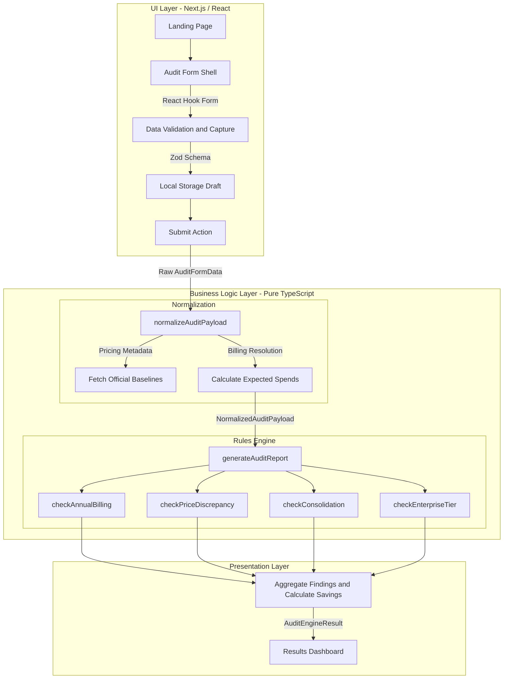

# Architecture & System Design

This document outlines the architectural decisions, data flow, and scaling strategy for the AI Spend Auditor MVP.

## System Diagram

## Data Flow: From Input to Audit Result

1. **User Input:** A user enters their team size, primary use cases, and dynamic rows of AI tools (e.g., Cursor, GitHub Copilot) into the `/` route.
2. **State & Persistence:** React Hook Form securely tracks the data, and `zod` strictly types it. A custom React hook (`usePersistentAuditDraft`) syncs this data to `localStorage` in real-time.
3. **Hydration (Normalization):** Upon submission, the raw `AuditFormData` is passed to the `normalizeAuditPayload` function. This step is critical: it fetches true baseline prices from `PRICING_CONFIG` and resolves mathematical discrepancies (like tracking negative discrepancies for legacy discounts).
4. **Engine Execution:** The resulting `NormalizedAuditPayload` is passed into `generateAuditReport`. 
5. **Rule Pipeline:** The engine maps over an array of stateless, pure function rules (`AuditRule[]`). Each rule deterministically evaluates the payload and returns `AuditRecommendation[]`.
6. **Final Render:** The engine sorts the recommendations by the highest `monthlySavings` and returns the final `AuditEngineResult`. The `/results` page immediately mounts and charts this data to the user.

## Why We Chose This Stack

* **Next.js 15 (App Router):** Provides a robust foundation for building modern web applications. The App Router allows us to seamlessly transition to Server Components when we introduce a database layer later.
* **TypeScript:** Non-negotiable for a financial calculation engine. Strict typing (`ToolId`, `NormalizedAuditPayload`) prevents catastrophic math errors and runtime crashes.
* **TailwindCSS + shadcn/ui:** Allows for rapid, accessible, and premium UI prototyping without the bloat of traditional component libraries. The design system looks enterprise-ready out of the box.
* **Vitest:** Chosen over Jest because of its speed and native support for Next.js path aliases (`@/`). Because the core Engine was decoupled from React, Vitest runs the entire business logic suite in under 3 seconds.

## Scaling to 10k Audits / Day

If this MVP was launched successfully and needed to handle 10,000 audits per day, the architectural footprint would shift from client-side execution to a persistent, server-driven architecture:

1. **Migrate to PostgreSQL (via Prisma or Drizzle):** 
   Currently, audits are stored anonymously in LocalStorage. At 10k audits/day, we would introduce a Postgres database to store user accounts, team profiles, and historical audits. This would allow users to track how their AI spend changes quarter-over-quarter.
2. **Move the Engine to a Server Action / Background Job:**
   While executing the engine client-side is fast for an MVP, at scale, we want to run `generateAuditReport` securely on the server. If a user submits a massive payload (e.g., 500 employee seats across 20 tools), we would queue the calculation using a background worker (like Inngest or Upstash) and stream the results back to the frontend.
3. **Dynamic Pricing Configuration API:**
   Our `PRICING_CONFIG` is currently hardcoded in a TypeScript file. At scale, SaaS pricing changes daily. We would abstract this into a CMS or a specialized Postgres table that a product team can update dynamically without requiring a code deployment.
4. **User Auth & Multi-tenant Workspaces:**
   We would integrate Clerk or NextAuth so multiple managers from the same startup could log in and collaboratively edit a centralized company audit sheet.
